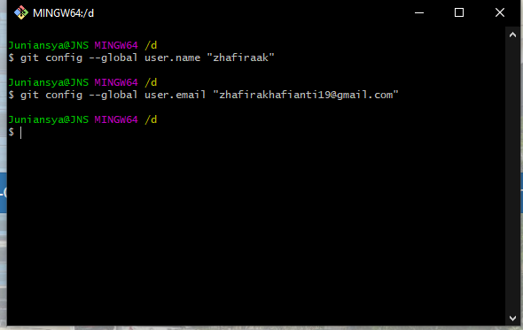
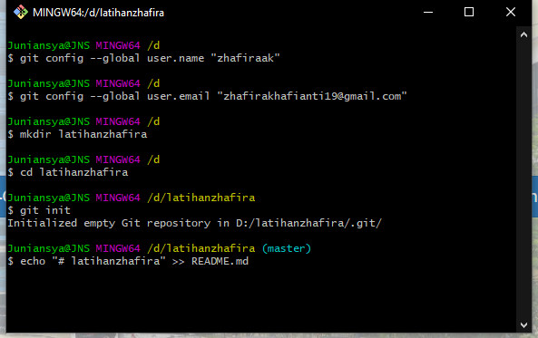
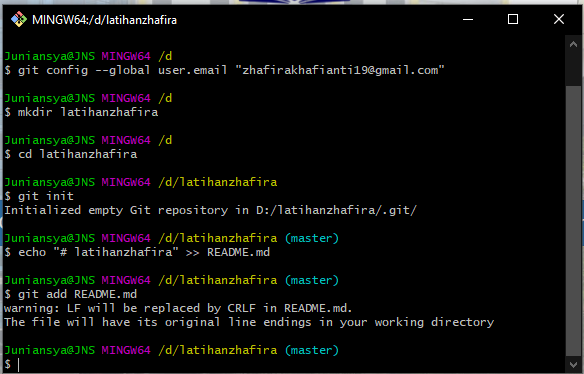
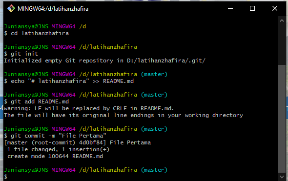
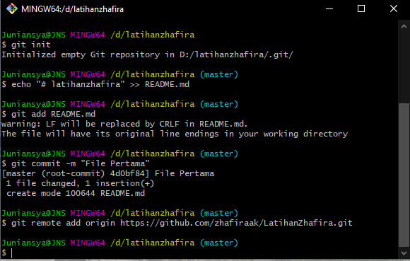
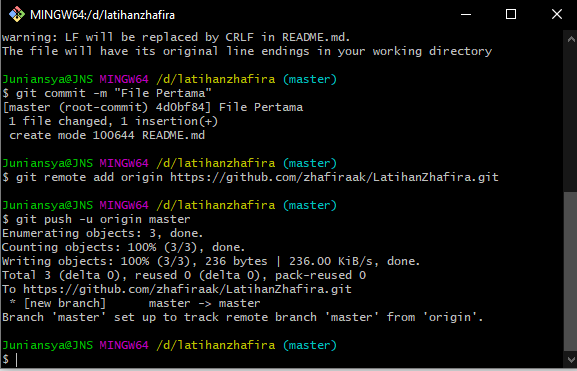

# latihanzhafira
## TUTORIAL

        

- Perlu dilakukan konfigurasi username dan email pada saat pertama kali menggunakan git.

- Jalankan perintah git init, untuk membuat repository local.
- Untuk membuat file dapat menggunakan Text Editor, Lalu menyimpan filenya pada repository. Sebagai contoh disini saya akan membuat file README.md dengan perintah berikut.

- Untuk menambahkan file yang sudah kita buat, gunakan perintah git add (Nama File) atau bisa menggunakan git add . (Jika file nya ada banyak)

- Untuk menyimpan perubahan yang ada kedalam database repository local, gunakan perintah git commit -m "nama project"

- Untuk menyimpan setiap perubahan pada repository local, gunakan perintah git remote add origin (url)..

- Untuk mengirim perubahan pada repository local ke server, gunakan perintah git push.
- Perintah ini akan meminta Username dan Password pada akun github mu.

- SELESAI

# TERIMAKASIH
